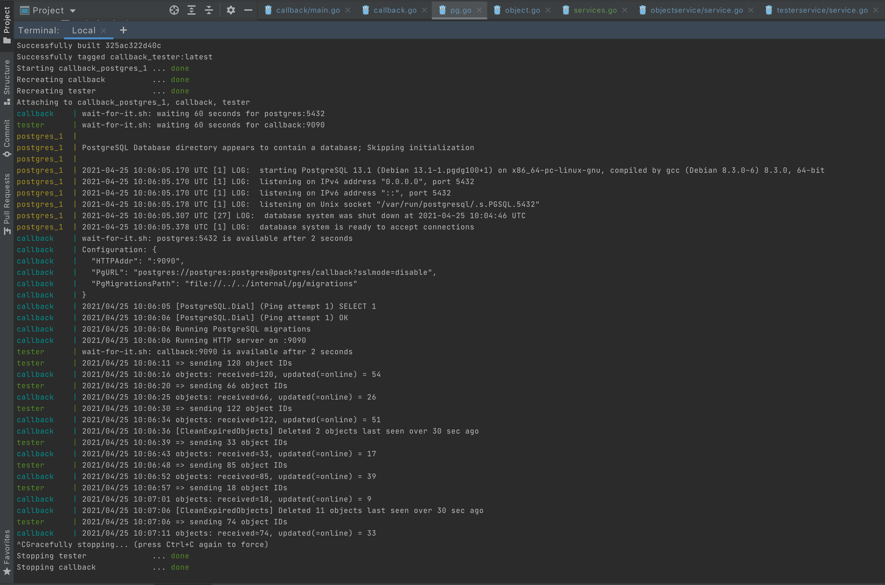

# Callback service

## Task description

Write a rest-service that listens on `localhost:9090` for POST requests on /callback.

Run the go service attached to this task. It will send requests to your service at a fixed interval of 5 seconds.

The request body will look like this:
```
{
    "object_ids": [1,2,3,4,5,6]
}
```
The amount of IDs varies with each request. Expect up to 200 IDs.

Every ID is linked to an object whose details can be fetched from the provided
service. Our service listens on `localhost:9010/objects/:id` and returns the
following response:
```
{
    "id": <id>,
    "online": true|false
}
```
Note that this endpoint has an unpredictable response time between 300ms and 4s!

Your task is to request the object information for every incoming object_id and filter the objects by their "online" status.
Store all objects in a PostgreSQL database along with a timestamp when the object was last seen.

Let your service delete objects in the database when they have not been received for more than 30 seconds.

**Important**: due to business constraints, we are not allowed to miss any callback to our service.

Write code so that all errors are properly recovered and that the endpoint is always available.

Optimize for very high throughput so that this service could work in production.

Bonus:
some comments in the code to explain the more complicated parts are appreciated
it is a nice bonus if you provide some way to set up the things needed for us to

Test your code.

## Issues found in task description and fixed

- `POST /callback` request could send zero object IDs
- `GET /objects/<id>` route didn't work (incorrect `strings.TrimPrefix`)
- `signal.Notify` tried to catch SIGKILL which was impossible
- `http.Client` had a timeout = 1 second which was not enough to wait for `POST /callback` response

## Solution notes

- :trident: clean architecture (handler->service->repository)
- :book: standard Go project layout (well, more or less :blush:)
- :cd: github CI/CD + docker compose + Makefile included
- :card_file_box: PostgreSQL migrations included
- :white_check_mark: tests with mocks included
- :boom: rate limiter for object details requests included

## HOWTO

- run with `make run`
- test with `go test -v ./...` (github scrutinizer doesn't like `make test` for some reason)

## A picture is worth a thousand words


